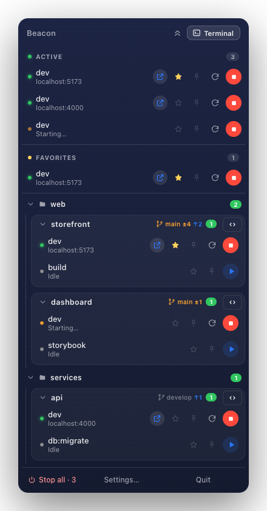
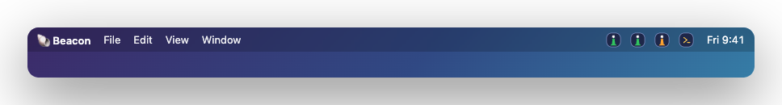
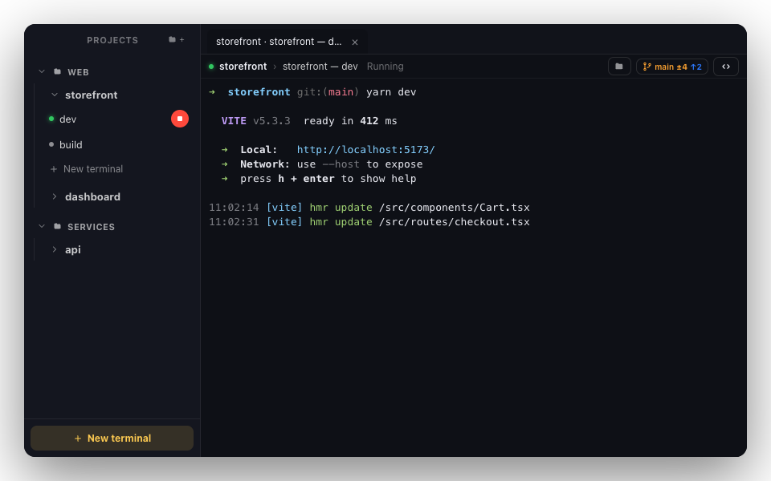
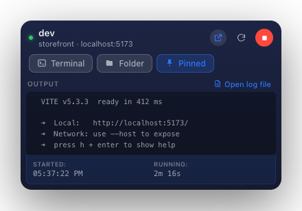
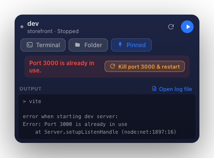
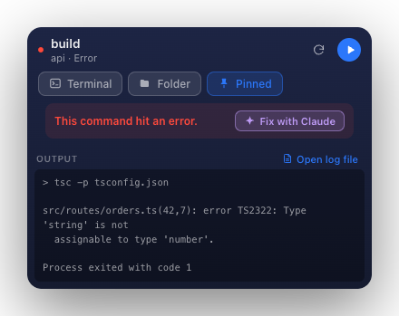

# 🐚 Beacon

### Run all your local dev servers from the macOS menu bar.

Beacon lives in your menu bar and turns the mess of a dozen `npm run dev` tabs
into one calm panel. See what's running, on which port, and its live logs —
start, stop, and jump to any project in a click.

**[⬇︎ Download for macOS](https://github.com/oguzberkacar/beacon-releases/releases/latest)**  ·  Apple Silicon · signed & notarized · auto-updates

 

 

## Why Beacon

If you juggle several projects, you know the pain: terminal tabs everywhere, no
idea which server is still up, hunting for the port a dev server picked. Beacon
puts every project's commands one click away and shows their live state at a
glance — the menu-bar icon itself glows green while something runs.

## Lives in your menu bar

The lighthouse icon shows your status at a glance — **green** while a server runs,
**amber** while one starts, **red** on error, and dim when idle. Pin any command
and it gets **its own menu-bar item** carrying the same live status, plus a
one-click terminal item — so the things you run most are always one click away.

## Works with your whole stack

Beacon isn't just for web projects. Point it at a folder and it auto-detects the
tasks for whatever's there — across **15+ ecosystems**:

| | |
|---|---|
| **JavaScript / TypeScript** | npm · yarn · pnpm · bun |
| **Python** | Django · Poetry · PDM |
| **Rust** | Cargo |
| **Go** | `go` tasks |
| **Java / Kotlin** | Gradle · Maven |
| **.NET** | `dotnet` |
| **PHP** | Composer |
| **Elixir** | Mix |
| **Dart / Flutter** | pub · Flutter |
| **Deno** | tasks |
| **Task runners** | Make · just · Taskfile · Procfile |
| **Containers** | Docker Compose |

Or type any custom command (`python manage.py runserver`, `air`, `mix phx.server`, …)
— Beacon runs and supervises it like everything else.

## Built-in terminal

A full tabbed terminal with a project sidebar, so you never leave the app. Open a
shell in any project, watch a command's live output, or let Beacon open one for you.

## Pin anything to the menu bar

Give a command its own menu-bar item — one click to start/stop, with a live log
tail and status, independent of the main popover.

## When something breaks, fix it in a click

**Port already in use?** Beacon spots the conflict and offers to kill the process
holding the port and restart — no more hunting for a stray PID.

**Command errored?** Repair it with **Fix with Claude**. Beacon opens the built-in
terminal and runs the `claude` CLI on the failure — using the Claude Code you're
**already signed in to**. No API key, no separate billing, no extra setup: it uses
your existing subscription, right in your terminal.

<table>
<tr>
<td align="center"></td>
<td align="center"></td>
</tr>
<tr>
<td align="center">Port conflict → kill &amp; restart</td>
<td align="center">Errored → fix with your Claude CLI</td>
</tr>
</table>

Fix with Claude needs the <a href="https://www.anthropic.com/claude-code">Claude Code CLI</a> installed and signed in. It's optional — everything else works without it.

## More

- **Active at a glance** — every running command in one list, newest first, with
  its detected URL. Green = running, amber = starting, red = error.
- **Favorites** — star the commands you reach for most and keep them on top.
- **Folder groups** — bucket projects into folders that collapse and remember.
- **Stop all** — kill every running process at once, with a checklist so you can
  spare the ones you want to keep.
- **Git at a glance** — branch and ahead/behind counts on each project.
- **Auto port detection** — Beacon reads `localhost:PORT` from a server's output
  and gives you a click-to-open link.

## Install

1. **[Download the latest `.dmg`](https://github.com/oguzberkacar/beacon-releases/releases/latest)**
2. Open it and drag **Beacon** to your Applications folder.
3. Launch it — the lighthouse appears in your menu bar. Click it to open the popover.

The app is signed with a Developer ID and notarized by Apple, so it opens without
Gatekeeper warnings. After the first install, **updates arrive automatically**.

## Requirements

- macOS 11 (Big Sur) or later
- Apple Silicon (M1 or newer)

## Updates

Beacon updates itself. It checks for a new release on launch and periodically while
running; when one is downloaded it shows a notification and installs on the next
restart. You can also trigger a check from the menu-bar menu → **Check for Updates…**

---

Beacon · a menu-bar launcher for developers who run a lot of servers.

